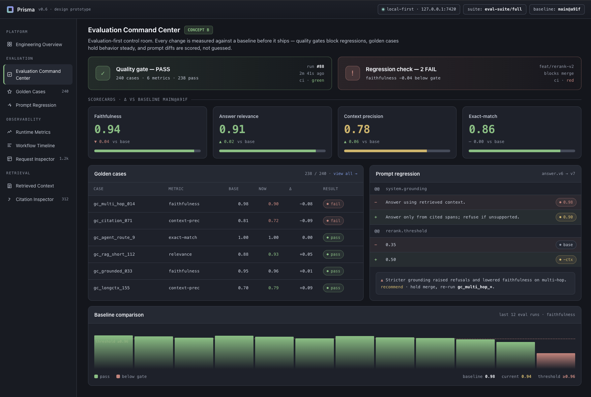

# André Ramos

**Artificial Intelligence Undergraduate Student | AI Systems Engineering, LLMOps, Backend & Platform Engineering**

I am preparing to begin university studies in Artificial Intelligence while building independent portfolio projects around reliable AI systems, local-first runtimes, backend services, and evaluation workflows.

My work focuses on building reliable AI systems with deterministic execution, persistence, observability, operational tooling, and clear feedback loops for continuous improvement. I care about engineering discipline: systems should be understandable, testable, and useful beyond a notebook.

The projects below are self-directed portfolio work. They reflect my interest in turning AI ideas into practical software that can be inspected, operated, and evaluated.

## Selected AI Projects

### Prisma v2 — Production LLMOps Platform

A local-first LLMOps platform focused on deterministic execution, persistence, evaluation, observability, prompt lifecycle, readiness, and operational tooling.

**Focus:** Local-First AI Runtime · LLMOps · Deterministic Execution · Persistence · Evaluation · Observability · Operational Tooling

**Status:** Completed Portfolio Project

**Repository:** [github.com/andrejr03/prisma-llmops](https://github.com/andrejr03/prisma-llmops)

### Prisma — Production LLM Engineering Platform

Prisma v1 is a local-first LLM engineering platform focused on Retrieval-Augmented Generation (RAG), AI evaluation, prompt regression, runtime observability, and source-grounded AI workflows. It demonstrates practical engineering around retrieval quality, evaluation, and reliable LLM application development.

**Focus:** Retrieval-Augmented Generation · AI Evaluation · Prompt Regression · Runtime Observability · Source-Grounded AI

**Status:** Completed Portfolio Project

**Repository:** [github.com/andrejr03/prisma](https://github.com/andrejr03/prisma)

### Crosswise — AI Document Reconciliation System

An AI system that reconciles invoices, purchase orders, and receipts, detects field-level discrepancies, preserves evidence, measures reliability, and routes uncertain cases to human review.

**Focus:** Document Intelligence · Reconciliation Systems · Reliability Scoring · Human Review · Explainable AI

**Status:** Completed Portfolio Project

**Repository:** [github.com/andrejr03/crosswise](https://github.com/andrejr03/crosswise)

### LexiBench AI — AI Evaluation & Reliability Workbench

An AI evaluation and reliability project for source-grounded question answering over the EU AI Act. LexiBench combines a versioned benchmark, evidence-completeness scoring, retrieval evaluation, failure taxonomy, and a static evaluation workbench to measure how reliably AI systems answer source-grounded questions.

**Focus:** AI Evaluation · Reliability Engineering · Evidence Completeness · Grounded Retrieval · Responsible AI

**Status:** Completed Portfolio Project

**Repository:** [github.com/andrejr03/lexibench-ai](https://github.com/andrejr03/lexibench-ai)

### StudentFit Bavaria — AI-Powered Student Housing Recommendation System

A recommendation system that helps students find housing that fits their needs, combining a transparent fit-scoring approach with geospatial analysis. It frames housing search as a decision-intelligence problem — ranking options against personal priorities rather than a single price filter.

**Focus:** Recommendation Systems · Decision Intelligence · Geospatial Analytics · Student Fit Scoring

**Status:** Completed Portfolio Project

**Repository:** [github.com/andrejr03/studentfit-bavaria](https://github.com/andrejr03/studentfit-bavaria)

### StatSport — Explainable Football Match Prediction

A football match prediction tool that pairs predictive modelling with clear, human-readable explanations for each forecast. The goal is not just to predict outcomes, but to surface *why* the model leans a certain way and how confident it is.

**Focus:** Machine Learning · Football Prediction · Explainable AI · Model Evaluation · Predictive Analytics

**Status:** Completed Portfolio Project

**Repository:** [github.com/andrejr03/statsport](https://github.com/andrejr03/statsport)

## Technical Interests

- LLMOps
- AI Systems Engineering
- Backend Engineering
- Platform Engineering
- AI Evaluation
- Machine Learning
- Recommendation Systems
- Explainable AI
- Predictive Analytics
- Geospatial Analytics

## Tools & Technologies

- Python
- Pandas
- Scikit-learn
- Streamlit
- Plotly
- Git
- GitHub
- Data Visualization
- Model Evaluation

## Current Focus

- Building AI systems engineering and LLMOps portfolio projects
- Strengthening backend engineering and platform engineering skills
- Developing production-quality portfolio projects with clear evaluation and observability
- Preparing for university studies in Artificial Intelligence

## Contact

- **LinkedIn:** https://www.linkedin.com/in/andr%C3%A9-ramos-8307b5416/
